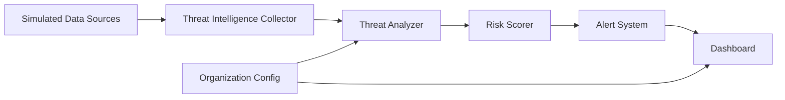
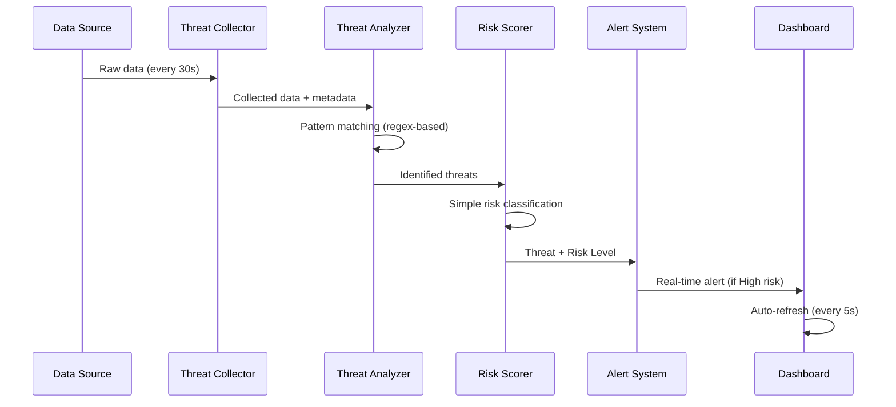

# Design Document: DarkTrace AI Dark Web Monitoring

## Overview

DarkTrace AI is a real-time threat intelligence and data leak detection platform designed as a hackathon MVP. The system simulates dark web monitoring by scanning simulated threat intelligence sources, OSINT feeds, and publicly available breach datasets to identify leaked sensitive data (credentials, corporate emails, API keys) associated with monitored organizations.

### Key Design Principles

1. **Simulated Intelligence Sources**: Uses mock datasets and simulated feeds rather than actual dark web crawling for MVP demonstration
2. **AI-Powered Detection Simulation**: Uses rule-based pattern matching and regex for "AI-powered" threat identification (no actual ML models)
3. **Real-Time Processing**: Near real-time data collection (30-second intervals) and immediate threat analysis
4. **Dashboard-Centric Design**: The dashboard is the primary interface and central focus of the MVP implementation, featuring visual alerts with color-coded risk indicators, popup notifications, and optional audio alerts
5. **Simplified Risk Model**: Three-tier risk classification (High/Medium/Low) based on data sensitivity

### Technology Stack Recommendations

Based on hackathon MVP requirements:

- **Backend**: Node.js with Express (fast prototyping, good async support for scanning)
- **Database**: Supabase (flexible schema for varied threat data structures)
- **Frontend**: React with real-time updates via WebSocket or Server-Sent Events
- **AI Simulation**: Lightweight rule-based NLP using regex and pattern matching (no actual ML models)
- **Visualization**: Chart.js or Recharts for threat trend graphs

## Architecture

### System Architecture

The system follows a pipeline architecture with four main stages:



### Component Interaction Flow

1. **Collection Phase**: Threat_Intelligence_Collector scans simulated sources every 30 seconds
2. **Analysis Phase**: Threat_Analyzer processes raw data using hybrid detection (rules + ML)
3. **Scoring Phase**: Risk_Scorer assigns risk levels based on data sensitivity
4. **Alerting Phase**: Alert_System triggers dashboard notifications for high-risk threats
5. **Visualization Phase**: Dashboard displays threats with 5-second auto-refresh

### Data Flow



## Components and Interfaces

### 1. Threat Intelligence Collector

**Responsibility**: Continuously scan simulated threat intelligence sources and collect raw data.

**Interface**:
```typescript
interface ThreatIntelligenceCollector {
  // Start continuous scanning with 30-second intervals
  startScanning(): void;
  
  // Stop scanning process
  stopScanning(): void;
  
  // Scan a specific data source
  scanDataSource(source: DataSource): Promise<CollectedData>;
  
  // Add new data source to scanning queue
  addDataSource(source: DataSource): void;
  
  // Retry logic with exponential backoff (max 3 attempts)
  retryWithBackoff(source: DataSource, attempt: number): Promise<CollectedData>;
}

interface DataSource {
  id: string;
  type: 'simulated_dataset' | 'osint_feed' | 'breach_database' | 'other';
  url: string;
  lastScanned?: Date;
  status: 'active' | 'inactive' | 'error';
}

interface CollectedData {
  sourceId: string;
  content: string;
  metadata: Record<string, any>;
  collectedAt: Date;
}
```

**Implementation Notes**:
- Use Node.js `setInterval` for 30-second scanning cycles
- Implement exponential backoff: 1s, 2s, 4s for retry attempts
- Store raw data with source attribution in Supabase
- For MVP: Use pre-generated JSON files as simulated sources

### 2. Threat Analyzer

**Responsibility**: Process collected data using rule-based pattern matching to identify and classify sensitive data.

**Interface**:
```typescript
interface ThreatAnalyzer {
  // Process raw collected data
  analyzeData(data: CollectedData, orgConfig: OrganizationConfig): Promise<Threat[]>;
  
  // Rule-based detection for specific patterns
  detectEmails(content: string, domains: string[]): EmailMatch[];
  detectPasswords(content: string): PasswordMatch[];
  detectAPIKeys(content: string): APIKeyMatch[];
  
  // Classify identified threats
  classifyThreat(match: SensitiveDataMatch): ThreatCategory;
}

interface Threat {
  id: string;
  organizationId: string;
  category: 'Credential_Leak' | 'API_Key_Exposure' | 'Email_Leak';
  sensitiveData: string; // Redacted or hashed for storage
  sourceId: string;
  sourceType: DataSource['type'];
  detectedAt: Date;
  keywords: string[];
  contextSnippet: string;
  riskLevel?: RiskLevel; // Assigned by Risk Scorer
}

interface OrganizationConfig {
  id: string;
  domains: string[];
  customKeywords: string[];
  alertPreferences: {
    soundEnabled: boolean;
    highRiskOnly: boolean;
  };
}
```

**Detection Strategy**:

Rule-based pattern matching using regex:
- Email regex: `/\b[A-Za-z0-9._%+-]+@(domain1|domain2|...)\b/gi`
- Password patterns: Look for "password:", "pwd:", "pass=" followed by values
- API key patterns: Common formats like `sk_live_`, `Bearer `, AWS keys, etc.

### 3. Risk Scorer

**Responsibility**: Assign risk levels to identified threats using simple classification rules.

**Interface**:
```typescript
interface RiskScorer {
  // Assign risk level based on threat category
  assignRiskLevel(threat: Threat): RiskLevel;
}

type RiskLevel = 'High' | 'Medium' | 'Low';
```

**Scoring Logic** (Simple Classification):
- **High**: API keys or access tokens
- **Medium**: Email + password combinations
- **Low**: Email addresses only

### 4. Alert System

**Responsibility**: Display real-time alerts in the dashboard interface (no persistence).

**Interface**:
```typescript
interface AlertSystem {
  // Trigger alert for high-risk threats
  triggerAlert(threat: Threat): void;
  
  // Display popup notification
  showPopupNotification(threat: Threat): void;
  
  // Play audio notification (if enabled)
  playAudioAlert(): void;
}
```

**Alert Display Rules**:
- High risk: Popup + audio (if enabled) + dashboard highlight
- Medium risk: Dashboard highlight only
- Low risk: Dashboard display only

### 5. Dashboard

**Responsibility**: Provide visual interface for threat monitoring and analysis. The dashboard is the primary interface and central focus of the MVP implementation.

**Interface**:
```typescript
interface Dashboard {
  // Get all threats for organization
  getThreats(orgId: string, filters: ThreatFilters): Promise<Threat[]>;
  
  // Get summary statistics
  getSummaryStats(orgId: string): Promise<SummaryStats>;
  
  // Get threat trends over time
  getThreatTrends(orgId: string, timeRange: TimeRange): Promise<TrendData>;
  
  // Subscribe to real-time updates
  subscribeToUpdates(orgId: string, callback: (threat: Threat) => void): void;
}

interface ThreatFilters {
  riskLevels?: RiskLevel[];
  categories?: ThreatCategory[];
  dateRange?: { start: Date; end: Date };
  sourceTypes?: DataSource['type'][];
}

interface SummaryStats {
  totalThreats: number;
  highRiskCount: number;
  mediumRiskCount: number;
  lowRiskCount: number;
  last24Hours: number;
}
```

**UI Components** (Primary Focus):
1. **Live Threat Feed**: Auto-refreshes every 5 seconds, color-coded by risk (Red/Yellow/Green)
2. **Trend Graph**: Line chart showing threat frequency over time
3. **Alert Popup**: Modal for high-risk threats with dismiss action
4. **Threat Details Panel**: Expandable view with full context and source info
5. **Filter Controls**: Dropdowns for risk level, category, date range, source type
6. **Summary Dashboard**: Key metrics and visual indicators

## Data Models

### Database Schema (Supabase)

For MVP, we use only 2 collections to keep it simple:

#### DataSources Collection
```typescript
{
  _id: ObjectId,
  type: 'simulated_dataset' | 'osint_feed' | 'breach_database' | 'other',
  url: string,
  name: string,
  status: 'active' | 'inactive' | 'error',
  lastScanned: Date,
  createdAt: Date
}
```

#### Threats Collection
```typescript
{
  _id: ObjectId,
  organizationId: string, // Simple string for MVP (single org)
  organizationDomains: string[], // Domains being monitored
  category: 'Credential_Leak' | 'API_Key_Exposure' | 'Email_Leak',
  sensitiveData: {
    type: string, // 'email', 'password', 'api_key'
    value: string, // For demo purposes (would be hashed in production)
  },
  sourceId: ObjectId, // Reference to DataSources
  sourceType: string,
  detectedAt: Date,
  keywords: string[],
  contextSnippet: string, // 200 chars of surrounding context
  riskLevel: 'High' | 'Medium' | 'Low',
  createdAt: Date
}
```

**Note**: CollectedData is stored in-memory only (not persisted). Alerts are displayed in UI only (not stored).


## Correctness Properties

*A property is a characteristic or behavior that should hold true across all valid executions of a system—essentially, a formal statement about what the system should do. Properties serve as the bridge between human-readable specifications and machine-verifiable correctness guarantees.*

### Property 1: Scan Interval Compliance

*For any* two consecutive scan cycles, the time interval between them should not exceed 30 seconds.

**Validates: Requirements 1.1**

### Property 2: Collected Data Completeness

*For any* data source scanned, the stored collected data should include text content, metadata, source attribution, and collection timestamp.

**Validates: Requirements 1.3, 1.5**

### Property 3: Sensitive Data Detection

*For any* text content containing credentials, API keys, or corporate emails from monitored domains, the Threat Analyzer should identify and extract them.

**Validates: Requirements 2.3, 2.4, 2.5**

### Property 4: Threat Category Classification

*For any* identified sensitive data, it should be classified into exactly one category: Credential_Leak, API_Key_Exposure, or Email_Leak.

**Validates: Requirements 3.1**

### Property 5: Risk Level Assignment Rules

*For any* threat, the assigned risk level should follow these rules:
- High if category is API_Key_Exposure
- Medium if category is Credential_Leak with both email and password
- Low if category is Email_Leak or Credential_Leak with email only

**Validates: Requirements 4.2, 4.3, 4.4**

### Property 6: High Risk Alert Triggering

*For any* threat with High risk level, an alert should be displayed in the dashboard with popup notification.

**Validates: Requirements 5.1, 5.2**

### Property 7: Threat Display Ordering

*For any* list of threats displayed for an organization, they should be sorted first by risk level (High > Medium > Low) and then by timestamp (most recent first).

**Validates: Requirements 6.1**

### Property 8: Risk Level Color Coding

*For any* threat displayed in the dashboard, the color indicator should match its risk level: Red for High, Yellow for Medium, Green for Low.

**Validates: Requirements 6.3**

### Property 9: Organization Domain Filtering

*For any* organization with configured domains, only threats containing sensitive data matching those domains should be associated with that organization and displayed in their dashboard.

**Validates: Requirements 11.1, 11.2, 11.3**


## Error Handling

Basic error handling will be implemented to ensure system continuity. The system will log errors and continue processing other data sources when individual components encounter issues. Advanced retry logic and failure recovery are part of future work.

## Testing Strategy

Basic unit testing will be performed for core components such as pattern detection, risk classification, and domain filtering. Advanced property-based testing and comprehensive test coverage are part of future work.

---

## Implementation Notes

### MVP Simplifications

For hackathon demonstration purposes:

1. **Simulated Data Sources**: Use pre-generated JSON files instead of actual dark web crawling
2. **Lightweight ML**: Use simple keyword matching and regex instead of complex ML models
3. **In-Memory Caching**: Cache recent threats in memory for faster dashboard updates
4. **Single Organization**: MVP can support single organization; multi-tenancy is future work
5. **No Authentication**: Focus on core functionality; add auth in production version

### Future Enhancements

Post-MVP improvements:

1. **Real Dark Web Integration**: Tor network integration, actual dark web forum monitoring
2. **Advanced ML Models**: Deep learning for context analysis, anomaly detection
3. **Multi-Tenancy**: Support multiple organizations with data isolation
4. **Authentication & Authorization**: OAuth2, role-based access control
5. **Notification Channels**: Email, Slack, PagerDuty integrations
6. **Threat Intelligence Feeds**: Integration with commercial threat intel providers
7. **Automated Response**: Automatic password reset triggers, account lockouts
8. **Compliance Reporting**: GDPR, SOC2, ISO27001 compliance reports